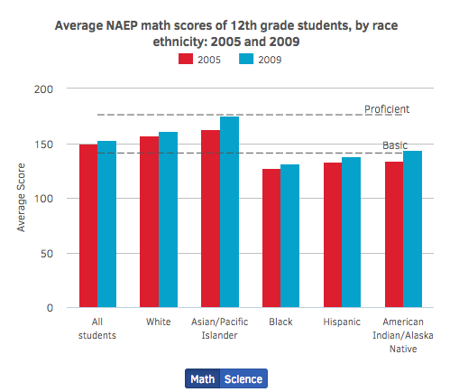

```{r, echo=FALSE, message=FALSE, warning=FALSE, fig.width=8, fig.height=4.5}
library(readr)
library(dplyr)
library(stringr)
library(ggplot2)
library(reshape2)
library(tidyverse)
library(stringr)
library(broom)
```

## Motivation for my project

The initial motivation for my project came merely from the fact that I am a minority in my major, Computer Science, and I will continue being a minority in the related field of software engineering in the year to come. 

What interested me was that although high schools are federally required to give equal education to all their students in all fields, a gender and minority split occurs in some fields, including STEM (Science, Technology, Engineering, Math): 
[Source](https://nsf.gov/nsb/sei/edTool/data/highschool-05.html)\



Furthermore, the fact that STEM industries---the tech industry being the most outstanding example---are dominated by white men is something that is fairly widely known. Even in entry level positions, there are fewer women and people of color; at the management level, the number of women and minorities is abysmally low:

[Google](https://www.google.com/diversity/index.html):\
\
\
\
[Facebook](http://newsroom.fb.com/news/2016/07/facebook-diversity-update-positive-hiring-trends-show-progress/):\
\
\
\


The tech industry is also not the only place where this is seen; [the New York Times reported](http://www.nytimes.com/2016/12/04/science/breakthrough-prizes-science-math.html) breakthrough prizes in math and science this year, and of the 12 people awarded, only one was a woman, and she was white. Of the men, only one was non-white. Comparing this to [census data](https://www.census.gov/quickfacts/), where 23% of people are non-white and 50.8% of people are female, it's pretty clear that there's a split.

However, while there are all sorts of compiled data on industry, and all sorts of articles detailing inequality, I haven't come across a study on gender and race in postsecondary education STEM fields.

## Why should you care?

In all aspects of life, diversity is an asset. In the case of science and technology, diversity is important to cater well to people of all walks of life; if diverse people use the products and services, then the people who create and administer should reflect as such. Including women and people of color brings new, as well as necessary, perspectives and ideas to the table, and many of the solutions created by those from diverse backgrounds solve problems that become glaringly obvious only after that diversity is added. For example, airbags in cars were originally designed with men in mind. Women's and children's body types were forgotten until a woman was included in the decision making. [Source](https://www.bloomberg.com/view/articles/2012-08-22/why-carmakers-always-insisted-on-male-crash-test-dummies)

More examples of when a lack of diversity affected people negatively can be found [here](http://www.usatoday.com/story/tech/2015/07/01/google-apologizes-after-photos-identify-black-people-as-gorillas/29567465/), when black people were labeled as "gorillas" by Google Photos' computer vision algorithms and [here](http://citeseerx.ist.psu.edu/viewdoc/summary?doi=10.1.1.10.6807), when darker skinned faces were not identified as faces.

Technology is also not the only place that the lack of diversity has affected negatively; the human genome project has been largely white, which ignores the majority of the human population. [Here](https://www.youtube.com/watch?v=C44r6knuJtU) is a TED talk about why genetic research must be more diverse.

## How my project relates
I initially wanted to see how racial and gender breakdowns in STEM transform from secondary education to postsecondary education to industry. Knowing when the percentages change most drastically can perhaps help us pinpoint the cause of the split when it happens. However, there was no thorough data about this topic on high schools or from industry, and I therefore settled for just data from universities. That being said, a couple of top STEM companies, particularly tech companies, have published general statistical breakdowns of their employees.

My project focuses mostly on analysis of the data (explained in more detail below) and compares this analysis with the minimal data available on some well known companies in some industries.

## Methods

### Data
Using [Ryan](go.middlebury.edu/ryan) as a resource, I found the [IPEDS (Integrated Postsecondary Education Data System)](https://nces.ed.gov/ipeds/datacenter/InstitutionList.aspx) data set. This is a government website dedicated to postsecondary statistics. Colleges are [obligated to report](https://nces.ed.gov/pubs2010/2010831rev.pdf) this data under the Higher Education Act of 1965.

For comparison purposes, I decided to use only data from U.S. undergraduate institutions (i.e. institutions that grant bachelor's degrees). Although there is also data on institutions that grant higher degrees, the majority of people who work in STEM fields [have a bachelor's degree only](https://www.nsf.gov/statistics/2015/nsf15311/tables/pdf/tab9-7.pdf).

On the IPEDS data website, there are options to choose several variables---anywhere from admissions test scores (SAT/ACT) to number of staff at each institution. For each of the variables, there was also the option of data from different school years. To stay consistent, I chose only data from the 2014-2015 school year. And because this project focuses on gender and race in STEM, I chose around 150 variables that were relevant. Such variables included:

* total number of students
* total number of women
* number of students in each of the majors of Biology, Engineering, Mathematics, and Physics
* number of students of each race in each of the majors listed above
* number of students of each race/gender combination in each of the majors listed above
* extra variables to see if there was correlation:
    + tuition (in-state and out-of-state)
    + SAT/ACT math scores
    + admissions rates

As a (liberal arts) note, grouping these races is arbitrary. There is, moreover, an assumption that gender is binary.

### Cleaning
Many of the schools that I retrieved data from were women's or men's colleges, which means they accept only people of a certain gender. I felt that for the purposes of this project, the data from those schools would skew my results, as the proportion of women in every field of a women's college, for example, would be 100%.

Initially, I just filtered out all the schools where either the variable "total_women" or "total_men" was equal to 0. However, after running this code, I found that Wellesley, a school I knew to be a women's college, was still in my data set. This is because Wellesley, and many other women's colleges, have male students--their only requirement to [identify as female](http://www.wellesley.edu/news/gender-policy/faq#DoRlgVp5lm2DmQ1Y.97). In other words, trans-women (assigned male at birth) are eligible students.

After figuring this out, I simply Googled "list of women's colleges in the US" and "list of men's colleges in the US." I found these on Wikipedia (admittedly not the best source) and manually filtered those lines of colleges out of the data.


### Calculations
After renaming all columns (which appeared in forms like "Grand total (EF2014A  All students total)"--total number of students--or "Hispanic women (EF2014CP  26.0000-Biological Sciences/Life Sciences  Undergraduate total)"--number of Hispanic women majoring in Biology), I started calculating what I was interested in. An easy example is the average proportion of women in these institutions; I mutated the data to have a column that was the total number of women divided by the total number of students, and took the mean of that column.

For the bar-charts, I followed a similar process; I calculated proportions (e.g. number of Black male engineers divided by the total number of male engineers) and plotted these proportions next to other relevant proportions.

## Results

### Simple gender breakdowns
```{r, echo = FALSE, message=FALSE}
schools <- read_csv("schools.csv")

```

```{r, echo=FALSE, warning=FALSE}
schools_w_single_sex <- schools
schools <- schools_w_single_sex %>% 
  filter(institution != "Agnes Scott College") %>% 
  filter(institution !="Alverno College") %>% 
  filter(institution != "Barnard College") %>% 
  filter(institution != "Bay Path University") %>% 
  filter(institution != "Bennett College for Women") %>% 
  filter(institution != "Brenau University") %>% 
  filter(institution != "Bryn Mawr College") %>% 
  filter(institution != "Cedar Crest College") %>% 
  filter(institution != "College of Saint Mary") %>% 
  filter(institution != "Columbia College") %>% 
  filter(institution != "Converse College") %>% 
  filter(institution != "Cottey College") %>% 
  filter(institution != "Hollins University") %>% 
  filter(institution != "Judson College") %>% 
  filter(institution != "Mary Baldwin College") %>% 
  filter(institution != "Meredith College") %>% 
  filter(institution != "Midway University") %>% 
  filter(institution != "Mills College") %>% 
  filter(institution != "Moore College of Art and Design") %>% 
  filter(institution != "Mount Holyoke College") %>% 
  filter(institution != "Mount Mary University") %>% 
  filter(institution != "Mount Saint Mary's University, Los Angeles") %>% 
  filter(institution != "Notre Dame of Maryland University") %>% 
  filter(institution != "Russell Sage College of The Sage Colleges") %>% 
  filter(institution != "St. Catherine University") %>% 
  filter(institution != "Saint Mary's College") %>% 
  filter(institution != "Salem College") %>% 
  filter(institution != "Scripps College") %>% 
  filter(institution != "Simmons College") %>% 
  filter(institution != "Smith College") %>% 
  filter(institution != "Spelman College") %>% 
  filter(institution != "Stephens College") %>% 
  filter(institution != "Sweet Briar College") %>% 
  filter(institution != "Trinity Washington University") %>% 
  filter(institution != "University of Saint Joseph") %>% 
  filter(institution != "Ursuline College") %>% 
  filter(institution != "Wellesley College") %>% 
  filter(institution != "Wesleyan College") %>% 
  filter(institution != "The Women's College of the University of Denver") %>% 
  filter(institution != "Hampden–Sydney College") %>% 
  filter(institution != "Morehouse College") %>% 
  filter(institution != "Saint John's University") %>% 
  filter(institution != "Wabash College") %>% 
  filter(institution != "Williamson Free School of Mechanical Trades")


#####STARTING ANALYSIS######
#overall gender proportion of schools
overall_gender_w_single_sex <- schools_w_single_sex %>% 
  select(institution, total, total_women) %>% 
  filter(!is.na(total_women)) %>% 
  filter(!is.na(total) ) %>% 
  filter(total_women != 0) %>% 
  mutate(proportion_women = total_women / total)
```


The average percentage of women in higher education is `r round(mean(overall_gender_w_single_sex$proportion_women), 3)`. This figure includes the women's colleges initially in the data set.
```{r, echo=FALSE, warning=FALSE}
overall_gender <- schools %>% 
  select(institution, total, total_women) %>% 
  filter(!is.na(total_women)) %>% 
  filter(!is.na(total) ) %>% 
  filter(total_women != 0) %>% 
  mutate(proportion_women = total_women / total)
```

The average percentage of women in these higher institutions, not including women's colleges, is `r round(mean(overall_gender$proportion_women), 4)`, which is not too different. 
```{r, echo=FALSE, warning=FALSE}
#overall gender in stem
overall_stem <- schools %>% 
  mutate(prop_stem = (women_eng + women_bio + women_math + women_phys)/(total_eng + total_bio + total_math + total_phys)) %>% 
  na.omit()
```

However, the average number of women in STEM, according to this data is `r round(mean(overall_stem$prop_stem), 3)`, which is significantly lower. This was calculated using the total number of women in each of the fields of Engineering, Biological Sciences/Life Sciences, Mathematics, and Physical Sciences and comparing that number to the overall number of women.
```{r, echo=FALSE, message=FALSE, warning=FALSE}
#breakdown of subjects by gender
breakdown_stem <- schools %>% 
  select(institution, total_eng, total_bio, total_math, total_phys, women_eng, women_bio, women_math, women_phys, men_eng, men_bio, men_math, men_phys) %>% 
  mutate(prop_women_eng = women_eng/total_eng) %>% 
  mutate(prop_women_bio = women_bio/total_bio) %>% 
  mutate(prop_women_math = women_math/total_math) %>% 
  mutate(prop_women_phys = women_phys/total_phys) %>% 
  mutate(prop_men_eng = men_eng/total_eng) %>% 
  mutate(prop_men_bio = men_bio/total_bio) %>% 
  mutate(prop_men_math = men_math/total_math) %>% 
  mutate(prop_men_phys = men_phys/total_phys) %>% 
  na.omit() %>% 
  summarise_each(funs(mean)) %>% 
  melt() %>% 
  rename(prop = value) %>% 
  filter(!is.na(prop)) %>% 
  filter(!grepl("total", variable)) %>% 
  filter(grepl("prop", variable)) %>% 
  mutate(gender = ifelse(grepl("women", variable), "women", "men")) %>% 
  mutate(topic = gsub(".*_", "", variable))
```

### Gender breakdown by subject
The only fields with available data were Engineering, Biological Sciences/Life Sciences, Mathematics, and Physical Sciences; in fact, there was no data available on any social sciences or humanities majors.

These fields have been abbreviated to "eng," "bio," "math," and "phys" respectively.

```{r, echo=FALSE}
stem_graph <- ggplot(breakdown_stem, aes(x = topic, y = prop, fill = gender)) + geom_bar(stat="identity") +
  labs(title = "Proportion of women by STEM topic") + 
  geom_hline(yintercept=mean(overall_gender$proportion_women), color="green") +
  geom_text(aes(0,mean(overall_gender$proportion_women),label = "%women in schools"), vjust = -1, hjust = 0, color = "green")

stem_graph
```

Looking at this graph, the inequal number in gender becomes obvious. Whereas the percentage of women in Biological Sciences/Life Sciences is even higher than the average number of women in colleges, the number of women in Engineering is by far lower. In fact, all three of the other topics are lower than the average number of women across colleges.


### Race breakdowns
I wanted to see overall race breakdowns across schools and then compare those numbers to race breakdowns across subjects. How I calculated this was I took the number of people in each race against the overall number of people in each respective group. So, for example, if I wanted to calculate the proportion of white women in engineering, I divided the number of white women in engineering by the total number of women in engineering.

The labels of the races are American Indian or Alaska Native (amind), Asian (asian), Black or African American (black), Hispanic (hisp), White (white), Native Hawaiian or Other Pacific Islander (hapac), Two or more races (twoplus), Race/ethnicity unknown (unk), and Nonresident alien (alien). 

Below are some of my results. 

```{r, echo=FALSE}
#average race breakdown
overall_race <- schools %>% 
  select(total, total_amind, total_alien, total_asian, total_black, total_hapac, total_hisp, total_twoplus, total_unk, total_white) %>% 
  mutate(amind = total_amind/total) %>% 
  mutate(alien = total_alien/total) %>% 
  mutate(asian = total_asian/total) %>% 
  mutate(black = total_black/total) %>% 
  mutate(hapac = total_hapac/total) %>% 
  mutate(hisp = total_hisp/total) %>% 
  mutate(twoplus = total_twoplus/total) %>% 
  mutate(unk = total_unk/total) %>% 
  mutate(white = total_white/total) %>% 
  na.omit() %>% 
  summarise_each(funs(mean)) %>% 
  t() %>% 
  melt() %>% 
  filter(!grepl("total", Var1)) %>% 
  mutate(topic = "overall")

overall_women_race <- schools %>% 
  select(total_women, total_amind, total_alien, total_asian, total_black, total_hapac, total_hisp, total_twoplus, total_unk, total_white, women_amind, women_alien, women_asian, women_black, women_hapac, women_hisp, women_twoplus, women_unk, women_white) %>% 
  mutate(amind = women_amind/total_women) %>% 
  mutate(alien = women_alien/total_women) %>% 
  mutate(asian = women_asian/total_women) %>% 
  mutate(black = women_black/total_women) %>% 
  mutate(hapac = women_hapac/total_women) %>% 
  mutate(hisp = women_hisp/total_women) %>% 
  mutate(twoplus = women_twoplus/total_women) %>% 
  mutate(unk = women_unk/total_women) %>% 
  mutate(white = women_white/total_women) %>% 
  na.omit() %>% 
  summarise_each(funs(mean)) %>% 
  t() %>% 
  melt() %>% 
  filter(!grepl("women", Var1), !grepl("total", Var1)) %>% 
  mutate(topic = "women")

overall_men_race <- schools %>% 
  select(total_men, total_amind, total_alien, total_asian, total_black, total_hapac, total_hisp, total_twoplus, total_unk, total_white, men_amind, men_alien, men_asian, men_black, men_hapac, men_hisp, men_twoplus, men_unk, men_white) %>% 
  mutate(amind = men_amind/total_men) %>% 
  mutate(alien = men_alien/total_men) %>% 
  mutate(asian = men_asian/total_men) %>% 
  mutate(black = men_black/total_men) %>% 
  mutate(hapac = men_hapac/total_men) %>% 
  mutate(hisp = men_hisp/total_men) %>% 
  mutate(twoplus = men_twoplus/total_men) %>% 
  mutate(unk = men_unk/total_men) %>% 
  mutate(white = men_white/total_men) %>% 
  na.omit() %>% 
  summarise_each(funs(mean)) %>% 
  t() %>% 
  melt() %>% 
  filter(!grepl("men", Var1), !grepl("total", Var1)) %>% 
  mutate(topic = "men")

race_overall <- rbind(overall_women_race, overall_race, overall_men_race)

ggplot(race_overall, aes(x = Var1, y = value, fill = topic)) + 
  geom_bar(stat="identity", position = "dodge") +
  coord_flip() +
  labs(title = "Racial breakdown, with gender", x = "Race", y = "Proportion", fill = "Type")
```


```{r, echo=FALSE}
#---#

overall_eng_race <- schools %>% 
  mutate(amind = amind_eng/total_eng) %>% 
  mutate(alien = alien_eng/total_eng) %>% 
  mutate(asian = asian_eng/total_eng) %>% 
  mutate(black = black_eng/total_eng) %>% 
  mutate(hapac = hapac_eng/total_eng) %>% 
  mutate(hisp = hisp_eng/total_eng) %>% 
  mutate(twoplus = twoplus_eng/total_eng) %>% 
  mutate(unk = unk_eng/total_eng) %>% 
  mutate(white = white_eng/total_eng) %>% 
  select(amind, alien, asian, black, hapac, hisp, twoplus, unk, white) %>% 
  na.omit() %>% 
  summarise_each(funs(mean)) %>% 
  t() %>% 
  melt() %>% 
  mutate(topic = "eng")

overall_bio_race <- schools %>% 
  mutate(amind = amind_bio/total_bio) %>% 
  mutate(alien = alien_bio/total_bio) %>% 
  mutate(asian = asian_bio/total_bio) %>% 
  mutate(black = black_bio/total_bio) %>% 
  mutate(hapac = hapac_bio/total_bio) %>% 
  mutate(hisp = hisp_bio/total_bio) %>% 
  mutate(twoplus = twoplus_bio/total_bio) %>% 
  mutate(unk = unk_bio/total_bio) %>% 
  mutate(white = white_bio/total_bio) %>% 
  select(amind, alien, asian, black, hapac, hisp, twoplus, unk, white) %>% 
  na.omit() %>% 
  summarise_each(funs(mean)) %>% 
  t() %>% 
  melt() %>% 
  mutate(topic = "bio")
  
overall_math_race <- schools %>% 
  mutate(amind = amind_math/total_math) %>% 
  mutate(alien = alien_math/total_math) %>% 
  mutate(asian = asian_math/total_math) %>% 
  mutate(black = black_math/total_math) %>% 
  mutate(hapac = hapac_math/total_math) %>% 
  mutate(hisp = hisp_math/total_math) %>% 
  mutate(twoplus = twoplus_math/total_math) %>% 
  mutate(unk = unk_math/total_math) %>% 
  mutate(white = white_math/total_math) %>% 
  select(amind, alien, asian, black, hapac, hisp, twoplus, unk, white) %>% 
  na.omit() %>% 
  summarise_each(funs(mean)) %>% 
  t() %>% 
  melt() %>% 
  mutate(topic = "math")

overall_phys_race <- schools %>% 
  mutate(amind = amind_phys/total_phys) %>% 
  mutate(alien = alien_phys/total_phys) %>% 
  mutate(asian = asian_phys/total_phys) %>% 
  mutate(black = black_phys/total_phys) %>% 
  mutate(hapac = hapac_phys/total_phys) %>% 
  mutate(hisp = hisp_phys/total_phys) %>% 
  mutate(twoplus = twoplus_phys/total_phys) %>% 
  mutate(unk = unk_phys/total_phys) %>% 
  mutate(white = white_phys/total_phys) %>% 
  select(amind, alien, asian, black, hapac, hisp, twoplus, unk, white) %>% 
  na.omit() %>% 
  summarise_each(funs(mean)) %>% 
  t() %>% 
  melt() %>% 
  mutate(topic = "phys")

race_by_topic <- rbind(overall_bio_race, overall_eng_race, overall_math_race, overall_phys_race, overall_race)

race_by_topic$topic <- factor(race_by_topic$topic, levels = c("bio", "eng", "math", "phys", "overall"))

ggplot(race_by_topic, aes(x = topic, y = value, fill = topic)) + 
  geom_bar(stat="identity", position = "dodge") +
  facet_wrap(~Var1) +
  coord_flip() +
  labs(title = "Racial breakdown by field", x = "Topic", y = "Proportion", fill = "Topic")
```


Some interesting finds were that the overall proportions of Black and Hispanic people outnumbered their counterparts in each of the fields. Furthermore, HBCUS (Historically Black Colleges and Universities) were included in my results, which may have affected these proportions.

Furthermore, while the difference is less noticeable, the number of Asian people in each of the fields is higher than the overall number of Asian people in these schools. Similarly, and more noticeably, the number of White people in each of these fields outweighs the total proportion as well.

```{r, echo=FALSE}
overall_women_race <- overall_women_race %>% 
  mutate(topic = "overall women")
bio_women_race <- schools %>% 
  mutate(amind = amind_women_bio/women_bio) %>% 
  mutate(alien = alien_women_bio/women_bio) %>% 
  mutate(asian = asian_women_bio/women_bio) %>% 
  mutate(black = black_women_bio/women_bio) %>% 
  mutate(hapac = hapac_women_bio/women_bio) %>% 
  mutate(hisp = hisp_women_bio/women_bio) %>% 
  mutate(twoplus = twoplus_women_bio/women_bio) %>% 
  mutate(unk = unk_women_bio/women_bio) %>% 
  mutate(white = white_women_bio/women_bio) %>% 
  select(amind, alien, asian, black, hapac, hisp, twoplus, unk, white) %>% 
  na.omit() %>% 
  summarise_each(funs(mean)) %>% 
  t() %>% 
  melt() %>% 
  mutate(topic = "bio")

eng_women_race <- schools %>% 
  mutate(amind = amind_women_eng/women_eng) %>% 
  mutate(alien = alien_women_eng/women_eng) %>% 
  mutate(asian = asian_women_eng/women_eng) %>% 
  mutate(black = black_women_eng/women_eng) %>% 
  mutate(hapac = hapac_women_eng/women_eng) %>% 
  mutate(hisp = hisp_women_eng/women_eng) %>% 
  mutate(twoplus = twoplus_women_eng/women_eng) %>% 
  mutate(unk = unk_women_eng/women_eng) %>% 
  mutate(white = white_women_eng/women_eng) %>% 
  select(amind, alien, asian, black, hapac, hisp, twoplus, unk, white) %>% 
  na.omit() %>% 
  summarise_each(funs(mean)) %>% 
  t() %>% 
  melt() %>% 
  mutate(topic = "eng")

math_women_race <- schools %>% 
  mutate(amind = amind_women_math/women_math) %>% 
  mutate(alien = alien_women_math/women_math) %>% 
  mutate(asian = asian_women_math/women_math) %>% 
  mutate(black = black_women_math/women_math) %>% 
  mutate(hapac = hapac_women_math/women_math) %>% 
  mutate(hisp = hisp_women_math/women_math) %>% 
  mutate(twoplus = twoplus_women_math/women_math) %>% 
  mutate(unk = unk_women_math/women_math) %>% 
  mutate(white = white_women_math/women_math) %>% 
  select(amind, alien, asian, black, hapac, hisp, twoplus, unk, white) %>% 
  na.omit() %>% 
  summarise_each(funs(mean)) %>% 
  t() %>% 
  melt() %>% 
  mutate(topic = "math")

phys_women_race <- schools %>% 
  mutate(amind = amind_women_phys/women_phys) %>% 
  mutate(alien = alien_women_phys/women_phys) %>% 
  mutate(asian = asian_women_phys/women_phys) %>% 
  mutate(black = black_women_phys/women_phys) %>% 
  mutate(hapac = hapac_women_phys/women_phys) %>% 
  mutate(hisp = hisp_women_phys/women_phys) %>% 
  mutate(twoplus = twoplus_women_phys/women_phys) %>% 
  mutate(unk = unk_women_phys/women_phys) %>% 
  mutate(white = white_women_phys/women_phys) %>% 
  select(amind, alien, asian, black, hapac, hisp, twoplus, unk, white) %>% 
  na.omit() %>% 
  summarise_each(funs(mean)) %>% 
  t() %>% 
  melt() %>% 
  mutate(topic = "phys")

women_race_by_topic <- rbind(bio_women_race, eng_women_race, math_women_race, phys_women_race, overall_women_race)

women_race_by_topic$topic <- factor(women_race_by_topic$topic, levels = c("bio", "eng", "math", "phys", "overall women"))

ggplot(women_race_by_topic, aes(x = topic, y = value, fill = topic)) + 
  geom_bar(stat="identity", position = "dodge") +
  facet_wrap(~Var1) +
  coord_flip() +
  labs(title = "Racial breakdown of women by field", x = "Topic", y = "Proportion", fill = "Topic")
```


Here, "overall women" refers to the overall breakdown of women, disregarding field.
Something interesting to note here is that the proportion of black female engineers is much lower than the overall percentage of black women.

Something else to notice is that the numbers Hispanic women in each of the STEM fields is lower than the overall proportion of Hispanic women as well.


```{r, echo=FALSE}
overall_men_race <- overall_men_race %>% 
  mutate(topic = "overall men")
bio_men_race <- schools %>% 
  mutate(amind = amind_men_bio/men_bio) %>% 
  mutate(alien = alien_men_bio/men_bio) %>% 
  mutate(asian = asian_men_bio/men_bio) %>% 
  mutate(black = black_men_bio/men_bio) %>% 
  mutate(hapac = hapac_men_bio/men_bio) %>% 
  mutate(hisp = hisp_men_bio/men_bio) %>% 
  mutate(twoplus = twoplus_men_bio/men_bio) %>% 
  mutate(unk = unk_men_bio/men_bio) %>% 
  mutate(white = white_men_bio/men_bio) %>% 
  select(amind, alien, asian, black, hapac, hisp, twoplus, unk, white) %>% 
  na.omit() %>% 
  summarise_each(funs(mean)) %>% 
  t() %>% 
  melt() %>% 
  mutate(topic = "bio")

eng_men_race <- schools %>% 
  mutate(amind = amind_men_eng/men_eng) %>% 
  mutate(alien = alien_men_eng/men_eng) %>% 
  mutate(asian = asian_men_eng/men_eng) %>% 
  mutate(black = black_men_eng/men_eng) %>% 
  mutate(hapac = hapac_men_eng/men_eng) %>% 
  mutate(hisp = hisp_men_eng/men_eng) %>% 
  mutate(twoplus = twoplus_men_eng/men_eng) %>% 
  mutate(unk = unk_men_eng/men_eng) %>% 
  mutate(white = white_men_eng/men_eng) %>% 
  select(amind, alien, asian, black, hapac, hisp, twoplus, unk, white) %>% 
  na.omit() %>% 
  summarise_each(funs(mean)) %>% 
  t() %>% 
  melt() %>% 
  mutate(topic = "eng")

math_men_race <- schools %>% 
  mutate(amind = amind_men_math/men_math) %>% 
  mutate(alien = alien_men_math/men_math) %>% 
  mutate(asian = asian_men_math/men_math) %>% 
  mutate(black = black_men_math/men_math) %>% 
  mutate(hapac = hapac_men_math/men_math) %>% 
  mutate(hisp = hisp_men_math/men_math) %>% 
  mutate(twoplus = twoplus_men_math/men_math) %>% 
  mutate(unk = unk_men_math/men_math) %>% 
  mutate(white = white_men_math/men_math) %>% 
  select(amind, alien, asian, black, hapac, hisp, twoplus, unk, white) %>% 
  na.omit() %>% 
  summarise_each(funs(mean)) %>% 
  t() %>% 
  melt() %>% 
  mutate(topic = "math")

phys_men_race <- schools %>% 
  mutate(amind = amind_men_phys/men_phys) %>% 
  mutate(alien = alien_men_phys/men_phys) %>% 
  mutate(asian = asian_men_phys/men_phys) %>% 
  mutate(black = black_men_phys/men_phys) %>% 
  mutate(hapac = hapac_men_phys/men_phys) %>% 
  mutate(hisp = hisp_men_phys/men_phys) %>% 
  mutate(twoplus = twoplus_men_phys/men_phys) %>% 
  mutate(unk = unk_men_phys/men_phys) %>% 
  mutate(white = white_men_phys/men_phys) %>% 
  select(amind, alien, asian, black, hapac, hisp, twoplus, unk, white) %>% 
  na.omit() %>% 
  summarise_each(funs(mean)) %>% 
  t() %>% 
  melt() %>% 
  mutate(topic = "phys")

men_race_by_topic <- rbind(bio_men_race, eng_men_race, math_men_race, phys_men_race, overall_men_race)

men_race_by_topic$topic <- factor(men_race_by_topic$topic, levels = c("bio", "eng", "math", "phys", "overall men"))

ggplot(men_race_by_topic, aes(x = topic, y = value, fill = topic)) + 
  geom_bar(stat="identity", position = "dodge") +
  facet_wrap(~Var1) +
  coord_flip() +
  labs(title = "Racial breakdown of men by field", x = "Topic", y = "Proportion", fill = "Topic")
```


There aren't any significant differences between this graph and those before it. However I would like to point out that the proportions of black men in math are a bit higher than black women.

It's also interesting to see that the proportion of Asian men in biology is fairly close to the proportion of Asian men in engineering, while the proportion of Asian women in biology is relatively lower than the proportion of Asian women in engineering.

### Other factors?
I thought it would be interesting to see how other factors of these institutions affected the proportion of women in STEM. (I also would have liked to see how these factors affected the proportion of race, but there were too many missing data points. This is further discussed in the Limitations section below.)
```{r, echo=FALSE, message=FALSE, warning=FALSE}

in_tuition_relation <- schools %>% 
  select(total_bio, total_eng, total_math, total_phys, women_bio, women_eng, women_math, women_phys, in_tuition) %>% 
  mutate(prop = (women_bio + women_eng + women_math + women_phys)/(total_bio + total_eng + total_math + total_phys))

ggplot(in_tuition_relation, aes(x = in_tuition, y = prop)) + 
  geom_point() +
  geom_smooth() +
  labs(title = "In-state tuition vs women in STEM", x = "Tuition", y = "Proportion women in STEM")

sat_relation <- schools %>% 
  select(total_bio, total_eng, total_math, total_phys, women_bio, women_eng, women_math, women_phys, sat_math_75) %>% 
  mutate(prop = (women_bio + women_eng + women_math + women_phys)/(total_bio + total_eng + total_math + total_phys))

ggplot(sat_relation, aes(x = sat_math_75, y = prop)) + 
  geom_point() +
  geom_smooth() +
  labs(title = "SAT math score vs women in STEM", x = "Score", y = "Proportion women in STEM")

admit <- schools %>% 
  select(total_bio, total_eng, total_math, total_phys, women_bio, women_eng, women_math, women_phys, p_admit_total) %>% 
  mutate(prop = (women_bio + women_eng + women_math + women_phys)/(total_bio + total_eng + total_math + total_phys)) 

ggplot(admit, aes(x = p_admit_total, y = prop)) + 
  geom_point() +
  geom_smooth() +
  labs(title = "Admission rate vs women in STEM", x = "Percent admit", y = "Proportion women in STEM")

```


The reasoning I had behind these factors:

* The tuition of certain schools might factor into the decisions that people make about their majors. Maybe they want to get more "bang for their buck", i.e. they would rather learn something that has more professional or practical use given the amount they pay.
* Higher average SAT math scores might be an indicator of a propensity for math and the sciences. Therefore there might be higher proportions overall of people taking STEM related classes and majoring in STEM fields.
* Many of the "harder-to-get-into" schools have strong Science and Math programs, so perhaps those who gain admission to these schools enter those fields.

However, there were several limitations to the accuracy of these findings. As seen in the graphs, there are very few valid data points, and therefore whatever best-fit lines are there are probably not trustworthy.

## Conclusions
As mentioned in the motivation section, inequality in STEM is not unknown. The findings in this project only reinforce many of the statistics people seem to know anecdotally. By adding this study with new data, there is reason to continue researching the causes for this inequality and perhaps start searching for solutions.

## Limitations
The data initially only had 997 lines of schools; after removing men's and women's colleges, there were only 988 lines.

Furthermore, schools are only required to submit certain statistics such as total number of students and total number of women and men; things like the number of (race) people in (subject) aren't required to be submitted. I therefore had lots of missing data in certain categories; this, of course, must have affected my overall analysis.

For my last three graphs, for example, over 90% of the data did not contribute to the analysis. This is because, as mentioned above, those 90% of schools didn't report stats like number of women engineers or number of women mathematicians.

One possible reason for the lack of reporting is that what they could report would reflect poorly upon the diversity of their school. This is, in fact, also the main reason for most STEM companies not reporting their data--and since they're not obligated by a federal agency to report, they don't.

## Future studies?
If there were data on:

* where students come from
* the high schools that students went to compared to the colleges they went to
* their income levels

the results would be interesting to see. A lot of inequality in STEM results from education inequality, which in turn results from income inequality.

In terms of data that already exists, it would be interesting to see how the gap continues to widen across further education by using data on Master's and Ph.D programs. It would also be interesting to see how equality has improved since, for example, the 1980s, and use that data to predict how the gap will continue to close.

