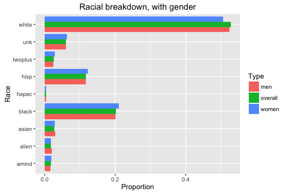

MATH 216 Data Science Final Project (Fall 2016)
================

-   Name: Shannia Fu
-   Project title: Gender and Race in STEM
-   Write-up on RPubs: <http://rpubs.com/shannia/gender-race_stem>
-   Abstract: It's well known that there is both gender and racial inequality in the STEM fields. There are a lot of statistics on many STEM related industries that show that the number of white men is disproportionately high. When does this split occur, however? What does the university-level data show us about this split? My project uses data from IPEDS, the Integrated Postsecondary Educaton Data System, to visualize the statistics on STEM in higher education.

